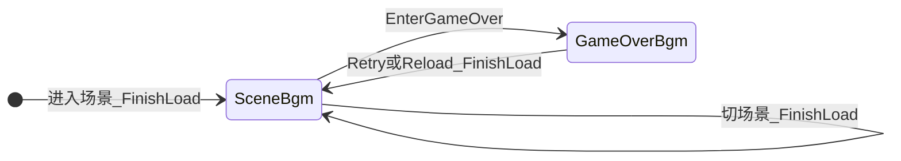
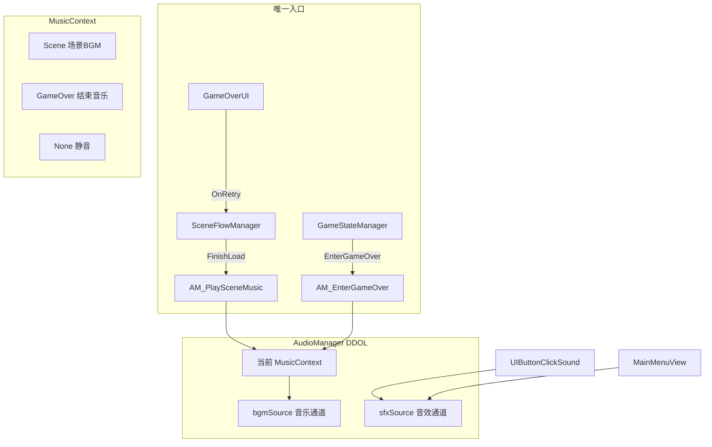

# 统一音频系统方案（BGM + 点击音 + 游戏结束音乐）

## 为什么要改 GameOver 播放方式

**现状问题：**

- [`GameStateManager.EnterGameOver`](Assets/_Game/Scripts/Core/GameStateManager.cs) 直接 `PlayOneShot(GameOver)`，与场景 BGM **各管各的**
- 死亡时 `Time.timeScale = 0`，关卡 BGM 可能仍在播，GameOver 音却走 SFX 通道，听感叠在一起
- 重试 / 过关转场后，**没有统一逻辑**恢复关卡 BGM
- `GameOver` 资源名像「音效」，但需求上是「游戏结束音乐」，应占用 **BGM 通道** 而非短 SFX

**目标：** 所有「背景音乐级」播放都走 `AudioManager` 的 **MusicContext**，业务代码只通知上下文切换，不直接选 clip。

---

## 统一架构





### 通道职责（固定规则）

| 通道 | 用途 | 示例 |
|------|------|------|
| **bgmSource** | 循环/长音乐，同一时刻只播一首 | MainMenuBGM、LevelBGM、**GameOverBGM** |
| **sfxSource** | 短音效，`PlayOneShot` | ButtonClick、（未来）跳跃/附着等 |

**GameOver 不再走 `PlayOneShot`**，改为切换 `MusicContext.GameOver` 并在 `bgmSource` 播放 `GameOverBGM`。

---

## AudioManager API（新增/调整）

文件：[`AudioManager.cs`](Assets/_Game/Scripts/Core/AudioManager.cs)

```csharp
enum MusicContext { None, Scene, GameOver }

// 场景音乐（由 SceneFlowManager 在 FinishLoad 调用）
void PlayMusicForScene(string sceneName);

// 游戏结束音乐（由 GameStateManager 调用，替代原 PlayOneShot）
void EnterGameOverMusic();

// 停止当前 BGM（切场景前可选）
void StopMusic();

// UI / 短音效
void PlayButtonClick();
void PlaySfx(string audioName);

// 音量（本步仅内存，默认 1.0；滑条后续接）
void SetMusicVolume(float volume);
void SetSfxVolume(float volume);
```

**实现要点：**

- `PersistAcrossScenes => true`，关卡场景内重复 `AudioManager` 节点由单例销毁
- `bgmSource.loop = true`（GameOver 若需只播一次，可在 SO 或配置里设 `loop=false`）
- `sfxSource.ignoreListenerPause = true`（`timeScale=0` 时 UI 点击音仍可播）
- `bgmSource.ignoreListenerPause = true`（**死亡时关卡 BGM 停掉、GameOver 音乐仍能播**）
- 切换音乐时：若 context 与曲目未变则 **不重启**（避免 FinishLoad 重复闪断）
- 可选：0.3s 音量淡入淡出（实现简单可用协程，非必须）

---

## 场景 BGM 配置（可复用）

新建 [`SceneBgmConfigSO.cs`](Assets/_Game/Scripts/Data/SceneBgmConfigSO.cs) + `Assets/_Game/Data/ScriptableObjects/SceneBgmConfig.asset`

| sceneName | bgmAudioName |
|-----------|--------------|
| MainMenu | MainMenuBGM |
| level1 ~ level4 | LevelBGM（或逐关不同） |

`SceneFlowManager` 持有引用，`FinishLoad()` 末尾：

```csharp
AudioManager.Instance?.PlayMusicForScene(SceneManager.GetActiveScene().name);
```

---

## 游戏结束音乐（统一流程）

### 1. 死亡时

[`GameStateManager.EnterGameOver`](Assets/_Game/Scripts/Core/GameStateManager.cs) **删除**：

```csharp
AudioManager.Instance.PlayOneShot(GameConstants.AudioNames.GameOver);
```

**改为：**

```csharp
AudioManager.Instance?.EnterGameOverMusic();
```

`EnterGameOverMusic()` 内部：

1. `musicContext = GameOver`
2. 停止/淡出当前场景 BGM
3. `bgmSource` 播放 `GameOverBGM`（`Resources/Audio/GameOverBGM.asset`）

### 2. 重试时

[`GameOverUI.OnRetryClicked`](Assets/_Game/Scripts/UI/GameOverUI.cs) → `SceneFlowManager.ReloadCurrentLevel()` → 转场 → `FinishLoad()` → `PlayMusicForScene` **自动恢复关卡 BGM**

无需在 `GameOverUI` 或 `ResetToPlaying` 里单独写恢复 BGM 逻辑（除非走不 reload 的 fallback 分支，那时调用 `PlayMusicForScene` 兜底）。

### 3. 过关 / 回主菜单时

已有 `PrepareForSceneLoad` → 加载 → `FinishLoad` → `PlayMusicForScene`，GameOver 音乐自然被场景 BGM 替换。

### 4. 常量重命名（建议）

[`GameConstants.AudioNames`](Assets/_Game/Scripts/Data/GameConstants.cs)：

```csharp
public const string MainMenuBGM = "MainMenuBGM";
public const string LevelBGM = "LevelBGM";
public const string GameOverBGM = "GameOverBGM";  // 原 GameOver，语义更清晰
public const string ButtonClick = "ButtonClick";
```

---

## UI 点击音效（不变，走 SFX 通道）

- [`UIButtonClickSound.cs`](Assets/_Game/Scripts/UI/UIButtonClickSound.cs)：挂任意 Button
- [`MainMenuView.BindButton`](Assets/_Game/Scripts/UI/MainMenuView.cs)：点击前 `PlayButtonClick()`
- 各弹窗确认/取消/关闭：同上或挂组件

与 BGM / GameOver **完全分离**，不会互相打断。

---

## 音频资源（Resources/Audio）

| SO 名 | 通道 | 说明 |
|-------|------|------|
| MainMenuBGM | BGM | 大厅循环 |
| LevelBGM | BGM | 关卡循环（4 关可先共用） |
| GameOverBGM | BGM | 死亡界面音乐（可循环或短曲） |
| ButtonClick | SFX | UI 点击 |

初版可用 [`break.mp3`](Assets/_Game/Art/Audio/break.mp3) 占位，美术后续只换 SO 内 clip。

---

## 改动文件清单

| 文件 | 操作 |
|------|------|
| `AudioManager.cs` | 重写：DDOL、双通道、MusicContext、EnterGameOverMusic |
| `SceneBgmConfigSO.cs` + `.asset` | 新建 |
| `SceneFlowManager.cs` | `FinishLoad` → `PlayMusicForScene` |
| `GameStateManager.cs` | 死亡改调 `EnterGameOverMusic`，删 OneShot |
| `GameConstants.cs` | 音频名常量（含 GameOverBGM） |
| `MainMenuController.cs` | `EnsureManagers` 创建 AudioManager |
| `MainMenuView.cs` + 弹窗 View | 点击音 |
| `UIButtonClickSound.cs` | 新建 |
| `Resources/Audio/*.asset` | 新建 4 个 SO |
| 文档 + 路线图 | 同步 |

**明确不改动：** `GameOverUI` 布局；音量滑条 `Row_BGM`（后续 Phase）。

---

## 测试方式

| 步骤 | 操作 | 预期 |
|------|------|------|
| 大厅 | Play MainMenu | MainMenuBGM 循环；按钮有点击音 |
| 进关 | 新游戏 | 切 LevelBGM |
| 死亡 | 落 DeathZone 或按 T | **关卡 BGM 停止**，播 GameOverBGM；点击 Retry 仍有 ButtonClick |
| 重试 | 点 Retry | 转场后恢复 LevelBGM |
| 回大厅 | 通关或 SceneFlowTest M | 恢复 MainMenuBGM |
| Build | 打包运行 | 全流程 BGM/GameOver/点击音正常 |

---

## 默认假设（未单独确认时按此实现）

| 项 | 默认 |
|----|------|
| GameOver | **占用 BGM 通道**，资源名 `GameOverBGM` |
| 关卡 BGM | 4 关共用 `LevelBGM` |
| 音量滑条 | 本步不做，API 预留 |
| 占位音频 | 先用 `break.mp3` |

确认本方案后即可开始实现（跳过 Phase 5，先做音频）。
