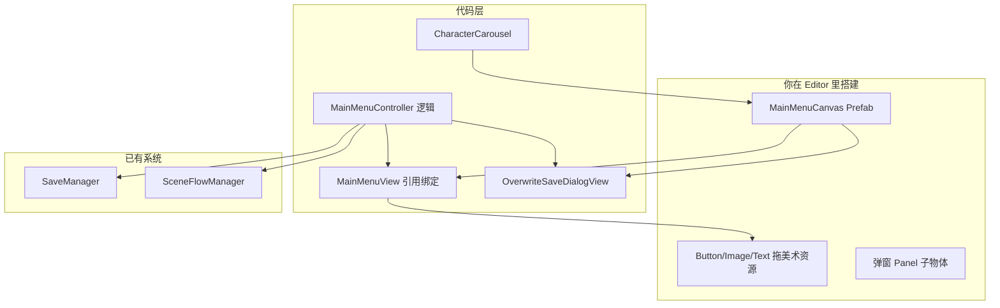

# 主界面 UI 接口化改造方案

## 你的预期 vs 现状

| 你的预期 | 现状问题 |
|----------|----------|
| 美术在 Editor 摆 Canvas、拖 Sprite/Button | [`MainMenuUI.cs`](Assets/_Game/Scripts/UI/MainMenuUI.cs) 约 300 行 `CreateXxx()` 运行时造 UI |
| 代码只提供接口与逻辑 | 视图与逻辑混在一个 570 行类里 |
| 后续 Phase 4 弹窗同样可拖资源 | 覆盖弹窗也在 `MainMenuUI` 里动态创建 |

**改造方向：** 删掉所有运行时 UI 构建；拆成 **Controller（逻辑）** + **View（Inspector 引用）** + **Panel 接口（弹窗契约）**。

---

## 推荐架构



### 三层职责

1. **Controller**（`MainMenuController`）  
   - 按钮回调、存档判断、调用 `SceneFlowManager`  
   - **不持有** Image/Sprite，不 `new GameObject`  
   - 通过 View / Panel 接口刷新 UI 状态  

2. **View**（`MainMenuView`）  
   - 仅 `[SerializeField]` 引用：`Button`、`Image`、`Text`  
   - 提供 `Bind(MainMenuController)` 注册点击  
   - 提供 `SetContinueEnabled(bool)` 等**纯显示**方法（interactable + 可选禁用色）  

3. **Panel 接口**（弹窗契约）  
   - `IMenuPanel`：`Show()` / `Hide()` / `IsVisible`  
   - `IOverwriteSaveDialog`：扩展 `Show(OverwriteSaveContext)` + 确认/取消事件  

---

## 具体文件改动

### 1. 新建接口（`Assets/_Game/Scripts/UI/`）

```csharp
// IMenuPanel.cs — 所有可开关面板的基础接口
public interface IMenuPanel {
    bool IsVisible { get; }
    void Show();
    void Hide();
}

// IOverwriteSaveDialog.cs
public enum OverwriteSaveSource { NewGame, LevelSelect }

public struct OverwriteSaveContext {
    public OverwriteSaveSource Source;
    public int TargetLevelIndex; // LevelSelect 时用
}

public interface IOverwriteSaveDialog : IMenuPanel {
    event Action<OverwriteSaveContext> Confirmed;
    event Action Canceled;
    void Show(OverwriteSaveContext context);
}
```

Phase 4 的 `IRulesPanel`、`ISettingsPanel`、`ILevelAchievementPanel`、`ICreditsPanel` 同样继承 `IMenuPanel`，**只定义 Show/Hide + 必要事件**，不生成 UI。

### 2. 拆分 [`MainMenuUI.cs`](Assets/_Game/Scripts/UI/MainMenuUI.cs)

| 新文件 | 职责 |
|--------|------|
| **`MainMenuController.cs`** | 原 `OnXxxClicked`、`LoadLevelFromMenu`、`EnsureManagers`；重命名并精简 |
| **`MainMenuView.cs`** | 引用区 + `Bind()` + `SetContinueEnabled()` |
| **`OverwriteSaveDialogView.cs`** | 实现 `IOverwriteSaveDialog`；引用 mask/panel/两行文字/两个按钮 |

**删除：** `EnsureUserInterface`、`CreateMenuArea`、`CreateOverwriteDialog` 等全部运行时构建代码（约 L231–L500）。

**[`CharacterCarousel.cs`](Assets/_Game/Scripts/UI/CharacterCarousel.cs)** 已基本符合预期，小改即可：
- 去掉 `BindDisplayImage()` 的运行时调用路径  
- 仅保留 Inspector 上的 `displayImage` + `levelDatabase`  
- 可选：支持**手动拖一组 Sprite** 覆盖 LevelDatabase 自动收集（美术想完全手控时）

### 3. `MainMenuView` 引用清单（你在 Inspector 拖）

```csharp
[Serializable]
public class MainMenuView : MonoBehaviour
{
    [Header("菜单按钮")]
    [SerializeField] private Button continueButton;
    [SerializeField] private Button newGameButton;
    [SerializeField] private Button levelAchievementButton;
    [SerializeField] private Button creditsButton;
    [SerializeField] private Button rulesButton;
    [SerializeField] private Button settingsButton;

    [Header("可选：继续按钮禁用态（不绑则只改 interactable）")]
    [SerializeField] private Graphic continueDisabledOverlay;

    [Header("展示区")]
    [SerializeField] private CharacterCarousel characterCarousel;

    public void Bind(MainMenuController controller) { /* 统一 AddListener */ }
    public void SetContinueEnabled(bool enabled) { /* interactable + overlay */ }
}
```

标题、背景图**不再由代码写死**——由你在 Canvas 里摆好 Text/Image，Controller 不负责改文案（除非以后需要本地化再加 `SetTitle(string)`）。

### 4. 场景 / Prefab 组织（美术工作流）

建议在 [`Assets/_Game/Prefabs/UI/`](Assets/_Game/Prefabs/UI/) 建：

```
MainMenuCanvas.prefab
├── Background          (Image — 拖主页面背景)
├── TitleArea           (Text × 2 — 美术排版)
├── MenuArea            (Button × 6 — 拖按钮图)
├── ShowcaseArea        (Image + CharacterCarousel)
└── Panels/
    ├── OverwriteSaveDialog   (OverwriteSaveDialogView)
    ├── LevelAchievement      (Phase 4 再挂)
    ├── Rules / Settings / Credits ...
```

[`MainMenu.unity`](Assets/_Game/Scenes/MainMenu.unity) 中：
- `MainMenuSystems` 挂 **`MainMenuController`**（替换现 `MainMenuUI`）
- Canvas 挂 **`MainMenuView`**，Inspector 拖齐按钮引用  
- 或直接把 Prefab 拖进场景

**不再**在代码里 `new GameObject("EventSystem")` 作为常态——Canvas 场景里放一个 `EventSystem`；Controller 仅在缺失时 `EnsureEventSystem()`（与 `GameOverUI` 一致，防忘配）。

### 5. Controller 与弹窗协作（逻辑不变）

```csharp
// 新游戏 — 逻辑保持，展示交给接口
public void OnNewGameClicked() {
    if (saveManager.HasSave)
        overwriteDialog.Show(new OverwriteSaveContext { Source = OverwriteSaveSource.NewGame });
    else
        StartNewGameAndLoadLevel(0);
}

// 弹窗确认事件
void OnOverwriteConfirmed(OverwriteSaveContext ctx) {
    if (ctx.Source == OverwriteSaveSource.NewGame) {
        saveManager.BeginNewGame();
        LoadLevel(0);
    } else {
        saveManager.SetCurrentLevel(ctx.TargetLevelIndex);
        LoadLevel(ctx.TargetLevelIndex);
    }
}
```

### 6. Phase 4 顺延策略（同样模式，不生成 UI）

| 面板 | View 组件 | 接口 |
|------|-----------|------|
| 关卡成就 | `LevelAchievementView` | `ILevelAchievementPanel` |
| 规则 | `RulesDialogView` | `IRulesPanel`（+ 滚动 `ScrollRect` 引用） |
| 设置 | `SettingsDialogView` | `ISettingsPanel`（大厅/游戏内模式枚举） |
| 致谢 | `CreditsDialogView` | `ICreditsPanel` |

`MainMenuController` 在 `Awake` 里 `GetComponentInChildren<IOverwriteSaveDialog>()` 等注入，或通过 `[SerializeField]` 显式拖引用（**推荐 SerializeField，更直观**）。

---

## 你需要做的（改造后）

1. 在 Unity 建 `MainMenuCanvas`，按需求文档摆布局  
2. 把 Button/Image/Text 拖到 `MainMenuView`、`OverwriteSaveDialogView` 对应槽位  
3. 在 `LevelDatabase` 或 `CharacterCarousel` 的手动 Sprite 列表配置轮播图  
4. Button 点击由 `MainMenuView.Bind()` 自动接线（**不必**逐个在 Inspector 绑 UnityEvent）

代码侧提供 **Editor 校验**（可选但推荐）：`MainMenuView` 加 `[ContextMenu("Validate References")]`，缺引用时 `Debug.LogError`，避免运行才发现没拖。

---

## 改造范围与风险

| 项 | 说明 |
|----|------|
| 删除代码 | `MainMenuUI` 中全部 `CreateXxx` |
| 重命名 | `MainMenuUI` → `MainMenuController`；场景组件需替换 |
| 首次进 Play | **界面为空**直到你在 Canvas 拖好引用（符合你的预期） |
| 继续按钮灰态 | 由 `SetContinueEnabled` 控制；禁用样式用你拖的 overlay 或 Button 的 Disabled Color |
| uGUI | 已按你的选择，继续 `Text` + `Image` + `Button` |

---

## 建议实施顺序

1. 加接口 `IMenuPanel` / `IOverwriteSaveDialog`  
2. 新建 `MainMenuView`、`OverwriteSaveDialogView`  
3. 从 `MainMenuUI` 抽出 `MainMenuController`，删除 UI 构建  
4. 更新 `MainMenu.unity`：挂新组件，清空旧 `MainMenuUI`  
5. 小改 `CharacterCarousel`（仅 Inspector 驱动）  
6. 更新 [`SceneFlowGuide.md`](Docs/SceneFlowGuide.md) 增加「美术搭 UI + 拖引用」说明  

**Phase 4** 在新模式下**只写 View + 接口 + Controller 接线**，不再写任何 `CreatePanel` 代码。

---

## 改造后测试方式

1. 未拖引用时：Play → Console 报 `MainMenuView` 缺引用（若加了校验）  
2. 拖齐 6 个按钮后：点击有响应（新游戏/继续/占位 Log 或打开 Panel）  
3. 有存档时：点新游戏 → 你搭的覆盖弹窗显示；确认后进 `level1`  
4. 无存档时：继续按钮 `interactable=false`  
5. `CharacterCarousel` 的 `displayImage` 拖好后轮播正常  

确认本方案后，我再按此重构现有 Phase 3 代码（不推进 Phase 4 界面实现）。
