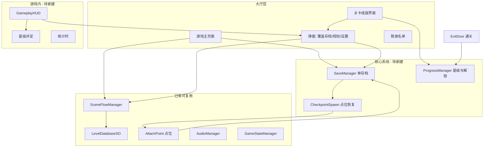
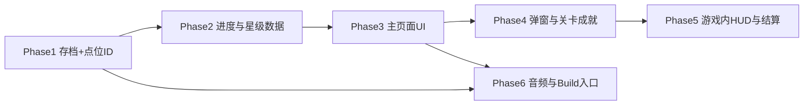

# 主界面与基础系统需求分析

## 需求范围概览

文档不仅描述「游戏主页面」，而是一套**大厅 + 存档 + 关卡成就 + 弹窗 + 游戏内 HUD** 的完整基础系统。与主界面强耦合的底层能力（单存档、点位、星级）必须先于 UI 交互落地。

---

## 一、需实现的功能清单（按模块）

### 1. 游戏主页面（[`MainMenu.unity`](Assets/_Game/Scenes/MainMenu.unity)）

| 区域 | 功能 | 现状 |
|------|------|------|
| 题目区 | 游戏大标题 + 副标题，无交互 | 场景仅有 Camera，无 UI |
| 菜单区 | **新游戏**：无存档直进第 1 关第 1 点位；有存档弹覆盖确认 | 无脚本、无按钮 |
| | **继续游戏**：有未完成存档时显示，进入存档关卡+点位 | 无存档系统 |
| | **关卡成就**：进入关卡选择界面 | 无界面 |
| | **致谢名单**：进入致谢动画 | 无实现 |
| | **规则**：弹出规则弹窗 | 无弹窗 |
| | **设置**：弹出大厅版设置弹窗 | 无弹窗 |
| 展示区 | 固定背景 + 各关卡角色轮播（2s/次，按关卡顺序循环） | [`LevelEntry.characterSprite`](Assets/_Game/Scripts/Data/LevelEntry.cs) 字段已有，未用于大厅 |
| 音频 | 大厅专属 BGM + 按钮点击音效 | [`AudioManager`](Assets/_Game/Scripts/Core/AudioManager.cs) 仅 SFX `PlayOneShot`，无 BGM 通道 |

### 2. 是否覆盖存档弹窗（共享组件）

- 黑色遮罩，遮罩下不可交互
- 动态首行文案：「开启新游戏，」或「如进入指定关卡，」
- 固定次行：「会覆盖当前存档，是否确认？」
- **取消**：关闭弹窗
- **确认**：按来源执行——新游戏 → 第 1 关第 1 点位；关卡成就 → 该关第 1 点位
- 唤出来源：主页面「新游戏」、关卡成就页跳转按钮/头像（头像待定）

### 3. 关卡成就界面

- 标题「关卡成就」
- 每关：主题角色图（未解锁：蒙黑+锁）、跳转按钮「第 N 关·XX」+ `>>`（未解锁无 `>>`）
- 三星展示（获得=黄色，未获得=空白）
- **跳转**：有未完成存档 → 覆盖弹窗；无 → 直进该关第 1 点位
- **恢复初始**：清空本页所有已获得星星（重置进度）
- 星级规则：仅**过关结算**后写入；同关取历史最高星数；过关后立刻刷新 UI

### 4. 规则弹窗

- 标题「规则」、左对齐可滚动正文（内容后填）、关闭按钮
- 与设置弹窗相同的遮罩层级

### 5. 设置弹窗（大厅版 / 游戏内版）

| 控件 | 大厅版 | 游戏内版 |
|------|--------|----------|
| 标题「设置」 | 有 | 有 |
| BGM / 音效滑动条 + 百分比 | 有（优先级低） | 有 |
| 退出游戏 | 有 | 无 |
| 存档（下方弹出「已存档」） | 无 | 有 |
| 回到主页面（先存档再回大厅） | 无 | 有 |
| 关闭按钮 | 有 | 有 |

### 6. 存档系统（贯穿主界面与游戏）

- **有且只有一个存档**
- **自动存档**：每次到达新 [`AttachPoint`](Assets/_Game/Scripts/Gameplay/AttachPoint.cs) 点位后触发
- **手动存档**：记录该关卡最远到达点位即可
- 存档字段（推断）：`levelIndex`、`checkpointId`、是否未完成（`inProgress`）、各关 `starCount[0..3]`
- 与 [`SceneFlowManager.LoadLevel(index)`](Assets/_Game/Scripts/Core/SceneFlowManager.cs) 和点位生成联动

### 7. 游戏内 UI（文档第 5–6 页，与主界面配套）

- **星级评定**：3 星初始全亮，不满足条件逐颗熄灭
  - 条件：顺利通关 / 零障碍碰撞 / 倒计时内通关
- **倒计时**：分:秒显示
- **设置图标**：打开游戏内版设置弹窗
- 过关时由 [`ExitDoor`](Assets/_Game/Scripts/Gameplay/ExitDoor.cs) 触发星级结算并写回 Progress

### 8. 致谢名单

- 文档仅描述「进入致谢动画」，无详细交互；需单独设计 Timeline/滚动字幕或独立场景

---

## 二、已有 vs 缺口对照

### 可直接复用

- [`SceneFlowManager`](Assets/_Game/Scripts/Core/SceneFlowManager.cs)：`LoadMainMenu()`、`LoadLevel(index)`、异步转场
- [`LevelDatabaseSO`](Assets/_Game/Scripts/Data/LevelDatabaseSO.cs) + [`LevelDatabase.asset`](Assets/_Game/Data/ScriptableObjects/LevelDatabase.asset)：关卡顺序、`displayName`、`characterSprite`
- [`SceneTransitionUI`](Assets/_Game/Scripts/UI/SceneTransitionUI.cs)：场景切换淡入淡出
- [`AttachPoint`](Assets/_Game/Scripts/Gameplay/AttachPoint.cs)：物理点位，**缺 checkpoint ID 与到达回调**
- [`BaseMonoManager`](Assets/_Game/Scripts/Core/BaseMonoManager.cs)：单例 + DDOL 模式
- uGUI + DOTween 项目内已有使用先例（[`GameOverUI`](Assets/_Game/Scripts/UI/GameOverUI.cs) 运行时建 UI）

### 关键缺口

1. **无存档 / 进度 / 解锁 / 星级持久化**
2. **MainMenu 场景为空**，且未加入 Build Settings（当前仅 [`SampleScene`](Assets/_Game/Scenes/SampleScene.unity)）
3. **无 Launch/Bootstrap**：游戏直接从关卡启动，非从主界面启动
4. **AttachPoint 无编号**：无法实现「第 N 个点位」存档与恢复
5. **AudioManager 无 BGM**、无音量持久化
6. **无 UI 目录脚本**：[`Assets/_Game/Scripts/UI/`](Assets/_Game/Scripts/UI/) 仅有 `GameOverUI`、`SceneTransitionUI`
7. **无游戏内 HUD、倒计时、障碍碰撞统计**
8. **GameState 枚举**无 `MainMenu` / `Paused`（[`GameStateManager`](Assets/_Game/Scripts/Core/GameStateManager.cs)）

---

## 三、涉及文件映射

### 新建脚本（建议目录）

| 文件 | 职责 |
|------|------|
| [`Assets/_Game/Scripts/Core/SaveManager.cs`](Assets/_Game/Scripts/Core/SaveManager.cs) | 单存档读写（PlayerPrefs 或 JSON）、`HasInProgressSave`、`ClearSave` |
| [`Assets/_Game/Scripts/Data/SaveData.cs`](Assets/_Game/Scripts/Data/SaveData.cs) | 存档数据结构 |
| [`Assets/_Game/Scripts/Core/ProgressManager.cs`](Assets/_Game/Scripts/Core/ProgressManager.cs) | 各关星级、解锁状态、恢复初始、过关结算 |
| [`Assets/_Game/Scripts/Core/CheckpointSpawnManager.cs`](Assets/_Game/Scripts/Core/CheckpointSpawnManager.cs) | 关卡加载后按存档将玩家放到指定 AttachPoint |
| [`Assets/_Game/Scripts/UI/MainMenuUI.cs`](Assets/_Game/Scripts/UI/MainMenuUI.cs) | 主页面菜单按钮、继续游戏显隐、打开子弹窗 |
| [`Assets/_Game/Scripts/UI/CharacterCarousel.cs`](Assets/_Game/Scripts/UI/CharacterCarousel.cs) | 展示区 2s 角色轮播 |
| [`Assets/_Game/Scripts/UI/OverwriteSaveDialog.cs`](Assets/_Game/Scripts/UI/OverwriteSaveDialog.cs) | 覆盖存档弹窗（枚举来源：新游戏 / 关卡选择） |
| [`Assets/_Game/Scripts/UI/LevelAchievementUI.cs`](Assets/_Game/Scripts/UI/LevelAchievementUI.cs) | 关卡成就列表、锁态、跳转、恢复初始 |
| [`Assets/_Game/Scripts/UI/RulesDialog.cs`](Assets/_Game/Scripts/UI/RulesDialog.cs) | 规则弹窗 + 滚动区 |
| [`Assets/_Game/Scripts/UI/SettingsDialog.cs`](Assets/_Game/Scripts/UI/SettingsDialog.cs) | 大厅/游戏内双模式设置 |
| [`Assets/_Game/Scripts/UI/CreditsUI.cs`](Assets/_Game/Scripts/UI/CreditsUI.cs) | 致谢名单展示 |
| [`Assets/_Game/Scripts/UI/GameplayHUD.cs`](Assets/_Game/Scripts/UI/GameplayHUD.cs) | 游戏内星星、倒计时、设置入口 |
| [`Assets/_Game/Scripts/Gameplay/LevelStarEvaluator.cs`](Assets/_Game/Scripts/Gameplay/LevelStarEvaluator.cs) | 局内三星条件追踪 |
| [`Assets/_Game/Scripts/Gameplay/LevelTimer.cs`](Assets/_Game/Scripts/Gameplay/LevelTimer.cs) | 倒计时逻辑 |
| [`Assets/_Game/Scripts/Gameplay/ObstacleHitTracker.cs`](Assets/_Game/Scripts/Gameplay/ObstacleHitTracker.cs) | 障碍碰撞计数（配合零碰撞星） |

### 需修改的已有脚本

| 文件 | 修改点 |
|------|--------|
| [`AttachPoint.cs`](Assets/_Game/Scripts/Gameplay/AttachPoint.cs) | 增加 `checkpointIndex`、首个点位标记、`OnPlayerReached` 通知 SaveManager |
| [`SceneFlowManager.cs`](Assets/_Game/Scripts/Core/SceneFlowManager.cs) | 支持带 checkpoint 的加载请求；进大厅时停 BGM/切 BGM |
| [`AudioManager.cs`](Assets/_Game/Scripts/Core/AudioManager.cs) | BGM 循环播放、音量控制、PlayerPrefs 持久化 |
| [`LevelEntry.cs`](Assets/_Game/Scripts/Data/LevelEntry.cs) | 可选：关卡解锁顺序、规则文案引用、倒计时配置 |
| [`LevelDatabaseSO.cs`](Assets/_Game/Scripts/Data/LevelDatabaseSO.cs) | 解锁判定辅助方法 |
| [`GameConstants.cs`](Assets/_Game/Scripts/Data/GameConstants.cs) | 音频名、存档 Key、UI 文案常量 |
| [`GameStateManager.cs`](Assets/_Game/Scripts/Core/GameStateManager.cs) | 可选 `MainMenu`/`Paused` 状态 |
| [`ExitDoor.cs`](Assets/_Game/Scripts/Gameplay/ExitDoor.cs) | 通关时调用星级结算 + 标记关卡完成/解锁下一关 |
| [`GameOverUI.cs`](Assets/_Game/Scripts/UI/GameOverUI.cs) | 可选：增加回主页面按钮（文档未明确要求，但设置内已有） |

### 场景 / 预制体 / 资产

| 路径 | 说明 |
|------|------|
| [`MainMenu.unity`](Assets/_Game/Scenes/MainMenu.unity) | 搭建 Canvas、题目区、菜单区、展示区、挂 `MainMenuUI` |
| `Assets/_Game/Prefabs/UI/Panels/` | 新建：`MainMenuPanel`、`OverwriteSaveDialog`、`LevelAchievementPanel`、`RulesDialog`、`SettingsDialog`、`GameplayHUD`（目录已规划，[框架计划](.cursor/plans/gamejam_框架架构_a21c08b8.plan.md) 中为空） |
| [`LevelDatabase.asset`](Assets/_Game/Data/ScriptableObjects/LevelDatabase.asset) | 补全 4 关 `displayName`、`characterSprite`、与美术 4 头像对应 |
| `ProjectSettings/EditorBuildSettings.asset` | 注册 `MainMenu` + 全部关卡场景；决定启动场景 |
| `Assets/_Game/Art/Sprites/` | 主页面背景、按钮、弹窗底板、星星、锁、设置图标等（美术清单见 PDF 第 7–8 页） |
| `Assets/_Game/Art/Audio/` + `Resources/Audio/` | 大厅 BGM、点击音效 |

### 参考文档

- [`Docs/SceneFlowGuide.md`](Docs/SceneFlowGuide.md)：场景切换 API 与 Build Settings 配置
- [`Docs/AssetsDirectoryGuide.md`](Docs/AssetsDirectoryGuide.md)：`_Game` 目录规范
- [`.cursor/plans/gamejam_框架架构_a21c08b8.plan.md`](.cursor/plans/gamejam_框架架构_a21c08b8.plan.md)：Bootstrap / UIManager 长期方案（可与本次轻量 uGUI 方案并行或延后）

---

## 四、推荐实现顺序（依赖关系）

1. **Phase 1 — 存档与点位**：`SaveData` + `SaveManager` + `AttachPoint` 编号 + 自动存档钩子 + `CheckpointSpawnManager`
2. **Phase 2 — 进度系统**：`ProgressManager`（星级、解锁、恢复初始、过关写入）
3. **Phase 3 — 主页面**：`MainMenu.unity` 布局 + `MainMenuUI` + `CharacterCarousel` + 接 `SceneFlowManager`
4. **Phase 4 — 弹窗与关卡成就**：`OverwriteSaveDialog`、`RulesDialog`、`SettingsDialog`、`LevelAchievementUI`、`CreditsUI`
5. **Phase 5 — 游戏内**：`GameplayHUD`、`LevelTimer`、`ObstacleHitTracker`、`LevelStarEvaluator`、改 `ExitDoor`
6. **Phase 6 — 整合**：`AudioManager` BGM/音量、Build Settings 以 `MainMenu` 为入口、常驻 `SceneFlowManager`

---

## 五、待你确认的设计点

文档中有几处需在实现前对齐（不影响分析结论，但影响细节）：

1. **关卡数量**：美术写 4 个头像，当前 [`LevelDatabase.asset`](Assets/_Game/Data/ScriptableObjects/LevelDatabase.asset) 仅 3 关
2. **解锁规则**：未写明「如何解锁下一关」——通常为第一关默认解锁，通关解锁下一关；需与星级/存档字段一起定
3. **致谢名单**：仅「进入致谢动画」，需定 Timeline 还是滚动 UI
4. **关卡成就页「头像点击」**：文档标注「此处待定」，是否与跳转按钮行为完全一致
5. **框架选型**：沿用现有 `GameOverUI` 式运行时 uGUI，还是按架构计划引入 `UIManager` + Prefab 面板栈

---

## 六、工作量粗估

| 模块 | 复杂度 | 说明 |
|------|--------|------|
| 存档 + 点位恢复 | 高 | 全系统基石，影响所有入口 |
| 主页面 UI | 中 | 布局 + 6 个菜单项 + 轮播 |
| 覆盖存档弹窗 | 低 | 可复用遮罩模式 |
| 关卡成就 | 中 | 列表、锁态、星级、重置 |
| 规则/设置弹窗 | 中 | 设置双模式 + 音量（低优） |
| 游戏内 HUD + 星级 | 高 | 新玩法统计 + 与通关结算联动 |
| 音频 BGM | 低–中 | 扩展 AudioManager |
| 美术资源 | 外部依赖 | PDF 已列清单，代码可先占位 |

**结论**：主界面本身约 **15–20%** 工作量；**存档、进度、游戏内 HUD** 占 **60%+**；其余弹窗与整合约 **20%**。建议把「主界面需求」按上述 7 模块分批交付，而非只做 `MainMenu.unity` 静态页。
