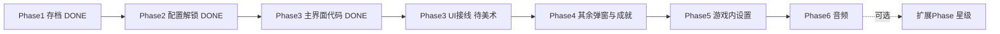

# 后续实现步骤（星级后移版）

## 原则调整

- **星级相关**（局内评定、倒计时、障碍扣星、成就页三星、「恢复初始」）→ 放到最后 **扩展 Phase**，当作可选功能
- **主流程**只依赖存档：`hasSave`、`currentLevelIndex`、`completedLevelIndices`
- **UI 风格**：具体 View 类 + Controller 事件接线，**不引入接口层**（已删除 `IMenuPanel` / `IOverwriteSaveDialog`）
- **主界面文档**：详见 [Docs/MainMenuGuide.md](../../Docs/MainMenuGuide.md)

---

## 已完成工作汇总

### Phase 1：关卡存档（完成）

| 能力 | 来源 |
|------|------|
| 本地存档 `save.json` | [`SaveManager`](Assets/_Game/Scripts/Core/SaveManager.cs) |
| 继续游戏 | `TryGetContinueLevel` → 关卡场景**初始位置** |
| 继续按钮灰态 | `CanContinue`（= `hasSave`） |
| 通关写进度 | [`ExitDoor`](Assets/_Game/Scripts/Gameplay/ExitDoor.cs) → `OnLevelCleared` |
| 场景切换 | [`SceneFlowManager`](Assets/_Game/Scripts/Core/SceneFlowManager.cs) |

存档字段：[`SaveData`](Assets/_Game/Scripts/Data/SaveData.cs) — `hasSave`、`currentLevelIndex`、`completedLevelIndices`。无点位存档。

### Phase 2：关卡配置与解锁（完成）

- [`LevelDatabase.asset`](Assets/_Game/Data/ScriptableObjects/LevelDatabase.asset)：4 关，场景名 `level1`–`level4`
- `SaveManager.IsLevelUnlocked`：第 1 关默认解锁，通关第 N 关解锁第 N+1 关
- 星级占位 API：`GetStarCount` / `SettleLevelStars` / `ResetAllStars`（空实现）
- Bug 修复：主菜单按 `O` 不再跳回主菜单，改为进入 `level1`
- 测试：[`SaveManagerTest`](Assets/_Game/Scripts/Core/SaveManagerTest.cs)、[`SceneFlowTest`](Assets/_Game/Scripts/Core/SceneFlowTest.cs)

### Phase 3：游戏主界面（代码完成，UI 待接线）

| 文件 | 职责 |
|------|------|
| [`MainMenuController.cs`](Assets/_Game/Scripts/UI/MainMenuController.cs) | 存档、跳转、弹窗、`RequestEnterLevel` |
| [`MainMenuView.cs`](Assets/_Game/Scripts/UI/MainMenuView.cs) | 6 Button 绑定、继续灰态 |
| [`OverwriteSaveDialogView.cs`](Assets/_Game/Scripts/UI/OverwriteSaveDialogView.cs) | 覆盖存档确认（新游戏 / 选关） |
| [`CharacterCarousel.cs`](Assets/_Game/Scripts/UI/CharacterCarousel.cs) | 角色图 2s 轮播 |
| [`MainMenu.unity`](Assets/_Game/Scenes/MainMenu.unity) | 系统节点 + Canvas 骨架 |

**待美术完成：** 6 个 Button、弹窗 UI、`CharacterCarousel` 的 Inspector 引用（见 MainMenuGuide 第九节）。

### Build Settings（提前完成，原 Phase 6 部分）

- Index 0：`MainMenu.unity`
- Index 1–4：`level1`–`level4`

### 已删除 / 简化

- `MainMenuUI.cs`（运行时生成 UI）
- 点位存档（`CheckpointSpawnManager`、`AttachPointRegistry` 等）
- UI 接口层（`IMenuPanel`、`IOverwriteSaveDialog`）

**已确认设定（仍有效）：** 4 关、线性解锁、进入关卡一律场景初始位置。

---

## 总路线图（修正后）



| 阶段 | 目标 | 状态 | 是否含星级 |
|------|------|------|-----------|
| Phase 1 | 单存档、继续游戏、通关写档 | **完成** | 无 |
| Phase 2 | 4 关配置 + 解锁 API + 星级占位 | **完成** | 仅占位 |
| Phase 3 | 主界面 Controller+View + 覆盖弹窗 | **代码完成** | 无 |
| Phase 3 UI | Editor 拖引用、验收主界面 | **待做** | 无 |
| Phase 4 | 退出/成就/致谢 View | **代码完成** | 成就页不显示真实星 |
| Phase 5 | 游戏内设置图标与弹窗 | 待做 | 无 |
| Phase 6 | BGM + 点击音 + GameOver 音乐 | **完成** | 无 |
| **扩展 Phase** | 完整星级系统 | 待做 | 全部 |

---

## Phase 3 UI 验收（当前建议下一步）

美术在 Editor 完成 [`MainMenu.unity`](Assets/_Game/Scenes/MainMenu.unity) 接线后验收：

1. 拖齐 `MainMenuView` 6 Button、`CharacterCarousel`
2. 重新挂载 `OverwriteSaveDialogView`，拖齐弹窗引用
3. Validate References 无报错
4. Play：无存档继续灰色；新游戏进 level1；有档新游戏弹覆盖确认

详细步骤见 [MainMenuGuide.md](../../Docs/MainMenuGuide.md)。

---

## Phase 4：退出游戏 / 关卡成就 / 致谢

### 实现思路

完成大厅交互闭环，**关卡成就不含真实星级**。

**注意：** ~~`OverwriteSaveDialog`~~ 已在 Phase 3 实现，Phase 4 **不再新建**。

**新建 View（延续 Phase 3 风格，无接口层）：**

| 文件 | 功能 |
|------|------|
| `ExitGameDialogView` | 退出确认 + 确认/取消 |
| `LevelAchievementView` | 4 关列表、锁态、`第N关·XX`、选关调 `RequestEnterLevel` |
| `CreditsView` | 致谢滚动字幕占位 |

**关卡成就（无星级版）：**

- 解锁：`SaveManager.IsLevelUnlocked`
- 跳转：已解锁 → 有存档时弹 `OverwriteSaveDialogView.ShowForLevelSelect` → 确认后 `SetCurrentLevel(n)` + 加载
- **三星区域**：UI 预留 3 个 Image 槽位，扩展 Phase 前隐藏或显示空星
- **「恢复初始」按钮**：扩展 Phase 前**隐藏或禁用**

**Controller 接线：**

- 选关统一走 `MainMenuController.RequestEnterLevel(int)`

**测试：** 退出/成就/致谢可开关；成就页锁/解锁正确；选关覆盖弹窗流程通。

---

## Phase 5：游戏内设置入口

### 实现思路

实现需求文档「游戏内 UI」中的**设置图标**部分；倒计时、星级 HUD **不做**。

**新建 / 扩展：**

- [`GameplayHUD.cs`](Assets/_Game/Scripts/UI/GameplayHUD.cs)（极简：仅右上角设置图标）
- 扩展 `SettingsDialogView` 游戏内逻辑：
  - **回到主页面**：`SetCurrentLevel` + `LoadMainMenu`
  - **关闭**
  - 手动存档（若保留）：`SetCurrentLevel(当前关)` + Toast「已存档」
  - 存档/回主页面按钮颜色区分

**对原有代码最小改动：**

- 各关卡场景或 Player Prefab 上挂 `GameplayHUD`

**测试：** 关卡内点设置打开弹窗；回主页面存档仍在；死亡 Retry 不受影响。

---

## Phase 6：音频

### 实现思路

- 扩展 [`AudioManager.cs`](Assets/_Game/Scripts/Core/AudioManager.cs)：BGM 循环 + 主界面点击音效（音量滑条可跳过）
- ~~Build Settings 注册~~ → **已完成**
- 启动流程：exe → MainMenu → 新游戏/继续
- 末关通关：沿用 `SceneFlowManager` → `LoadMainMenu`

**测试：** Build exe 完整跑通：主界面 → 关卡 → 通关回大厅（或进下一关）；主界面有 BGM。

---

## 扩展 Phase（星级系统，最后做）

### 范围

| 项 | 内容 |
|----|------|
| 数据 | `SaveData.levelStars[4]` |
| 逻辑 | `GetStarCount` / `SettleLevelStars` / `ResetAllStars` 实装 |
| 局内 | `LevelTimer`、`ObstacleHitTracker`、`LevelStarEvaluator`、`GameplayHUD` 星+倒计时 |
| 结算 | [`ExitDoor`](Assets/_Game/Scripts/Gameplay/ExitDoor.cs) 通关时 `SettleLevelStars` |
| UI | 成就页显示真实三星；启用「恢复初始」 |
| 配置 | 可选 `LevelEntry.timeLimitSeconds` |

### 预留接口（Phase 2 已写入，扩展 Phase 填实现）

```csharp
int GetStarCount(int levelIndex);
void SettleLevelStars(int levelIndex, int starCount);
void ResetAllStars();
```

可选：[`ILevelStarProvider`](Assets/_Game/Scripts/Data/ILevelStarProvider.cs) 接口。

---

## 仍待确认的不确定项

| # | 问题 | 建议默认 |
|---|------|----------|
| 1 | 覆盖存档：新游戏 + 选关都在 `hasSave` 时弹？ | 是（已实现） |
| 2 | 游戏内「手动存档」按钮 | 保留 = `SetCurrentLevel` + Toast |
| 3 | 致谢形式 | 主界面内滚动字幕占位 |
| 4 | 音量滑条 | Phase 6 跳过，扩展后再做 |
| 5 | UI 组织 | View + Inspector 拖引用（与 Phase 3 一致） |
| 6 | 第 4 关场景名 | `level4`（已配置） |

**扩展 Phase 再确认：** 障碍 Tag/Layer、倒计时每关配置、未通关是否写 0 星。

---

## 执行节奏

每步：**说明思路 → 实现 → 给测试方式 → 停下等你确认**。

**建议下一步：**

1. 美术完成 Phase 3/4 UI 接线并验收
2. 开始 Phase 5（游戏内设置入口）
