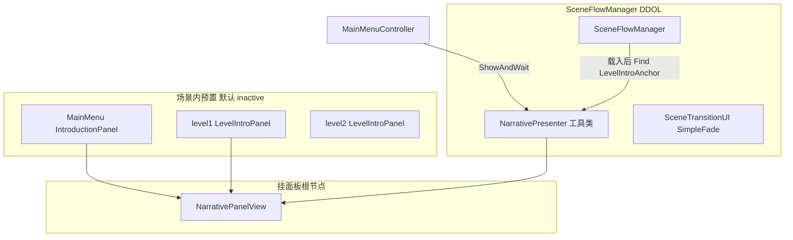
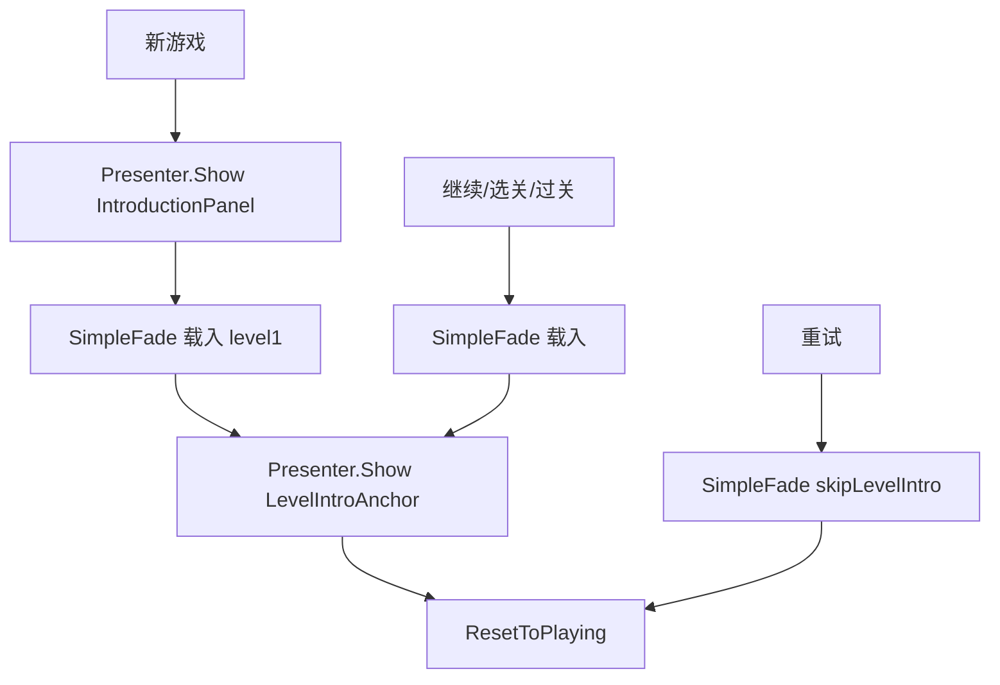

# 转场叙事系统改造方案（简化版）

## 为什么换设计

原方案（`INarrativePanelBindings` + `NarrativeSequenceView` + `LevelEntry.introPrefab` + `GameState.Narrative`）功能正确，但对 Game Jam 偏重：

| 原方案 | 问题 |
|--------|------|
| 接口 + 实现类 | 只有一种面板结构，接口多余 |
| 运行时 `Instantiate` 预制体 | 每关面板本可预置在场景里，不必动态创建 |
| `LevelEntry` 存 prefab 引用 | 与「每场景独立」重复一份配置 |
| 新增 `Narrative` 状态 | `Transitioning` 已能阻止输入 |
| 多个 struct / 专用 API | 实际只需「显示面板 → 等点击」 |

**推荐模式：场景常驻面板 + Presenter 工具类**（与现有 `MainMenuView` / `*DialogView` 的 Editor 拖引用风格一致）

---

## 简化后架构（2 个新脚本 + 1 个场景锚点）



| 组件 | 行数级 | 职责 |
|------|--------|------|
| `NarrativePanelView` | ~30 | 挂面板根节点；暴露 `backgroundImage`；`Show()` / `Hide()` |
| `NarrativePresenter` | ~80 | DDOL；延迟继续提示 + 全屏点击；**唯一公开 API** |
| `LevelIntroAnchor` | ~15 | 每关场景 1 个；拖入本关 `NarrativePanelView` |

**删掉：** `INarrativePanelBindings`、`NarrativePlayRequest`、`NarrativeHintSettings`、`GameState.Narrative`、`LevelEntry.introPrefab`

---

## 核心 API（足够后续直接使用）

```csharp
// 挂介绍面板根节点（预制体根或场景内面板根）
public class NarrativePanelView : MonoBehaviour
{
    [SerializeField] Image backgroundImage;
    public Image BackgroundImage => backgroundImage;

    public void Show();   // SetActive(true)，面板内动画自行处理
    public void Hide();   // SetActive(false)
}

// DDOL，挂在 SceneFlowManager 节点
public class NarrativePresenter : MonoBehaviour
{
    [Header("继续提示（全局共用）")]
    [SerializeField] TMP_FontAsset continueHintFont;
    [SerializeField] string continueHintText = "点击空白处继续";
    [SerializeField] float continueHintDelay = 1.5f;

    public bool IsShowing { get; }

    /// <summary>唯一播放入口。panel 为场景中已存在的面板（含预制体实例）。</summary>
    public IEnumerator ShowAndWait(NarrativePanelView panel, Sprite background = null);

    // 后续任意处直接调用示例：
    // yield return NarrativePresenter.Instance.ShowAndWait(myPanel, myBg);
}
```

**`ShowAndWait` 流程：**

1. 保持 `GameState.Transitioning`（不新增状态）
2. 若有 `background` → 写入 `panel.BackgroundImage.sprite`
3. `panel.Show()`
4. 延迟后显示底部 TMP 继续提示（Presenter 自建，不放进面板预制体）
5. 全屏透明点击层等待一次点击
6. `panel.Hide()`，隐藏提示

---

## 数据放哪（场景本地，不重复配 SO）

| 内容 | 配置位置 | 说明 |
|------|----------|------|
| 新游戏介绍面板 | `MainMenu.unity` 已有 `IntroductionPanel` | 挂 `NarrativePanelView`，`MainMenuController` 拖引用 |
| 各关介绍面板 | 各 `levelN.unity` 内预置（可拖入独立 prefab 实例） | 每关各自一份，符合「每场景独立」 |
| 各关背景图 | `LevelIntroAnchor.backgroundSprite` 或面板内 `img_Bg` 默认图 | 二选一：Anchor 可在运行时覆盖 sprite |
| 继续提示字体 | `NarrativePresenter` Inspector | 只配一次 |

**`LevelIntroAnchor`**（每关场景 1 个空物体）：

```csharp
public class LevelIntroAnchor : MonoBehaviour
{
    [SerializeField] NarrativePanelView panel;
    [SerializeField] Sprite backgroundSprite;  // 可选，运行时覆盖面板背景

    public NarrativePanelView Panel => panel;
    public Sprite BackgroundSprite => backgroundSprite;
}
```

`SceneFlowManager` 载入关卡后：`FindObjectOfType<LevelIntroAnchor>()` → `ShowAndWait(anchor.Panel, anchor.BackgroundSprite)`

找不到 Anchor 或 panel 为空：Warning + 跳过介绍。

**`LevelEntry` 不再增加 `introPrefab`**；`backgroundSprite` 可保留给成就页等 UI，或逐步迁到 Anchor。

---

## 流程（行为矩阵不变）

| 进入方式 | 全局介绍 | 关卡介绍 |
|----------|----------|----------|
| 新游戏 | MainMenu `IntroductionPanel` | 目标关 `LevelIntroAnchor` |
| 继续 / 选关 | 否 | 目标关 `LevelIntroAnchor` |
| 过关 → 下一关 | 否 | **下一关** `LevelIntroAnchor` |
| 重试 | 否 | **否**（`skipLevelIntro=true`） |
| 末关通关 | — | `OnAllLevelsCompleted()` 钩子 → 回主菜单 |



### SceneFlowManager 改动要点

`SceneLoadRequest` 只加一个字段：

```csharp
public bool SkipLevelIntro;  // 仅 ReloadCurrentLevel 为 true
```

`LoadSceneRoutine`：

```
SimpleFade 淡出 → LoadSceneAsync
→ if (关卡场景 && !SkipLevelIntro) Presenter.ShowAndWait(anchor)
→ ResetToPlaying + BGM + FinishLoad
```

`ReloadCurrentLevel()`：`SkipLevelIntro = true`

末关 `LoadNextLevel()`：`OnAllLevelsCompleted()` 空钩子 → `LoadMainMenu()`（视频等后续在钩子里扩展）

---

## 新游戏流程 — MainMenuController

复用场景内已有 [`IntroductionPanel`](Assets/_Game/Scenes/MainMenu.unity)，不经过 `LevelDatabaseSO`：

```csharp
[SerializeField] NarrativePanelView newGameIntroPanel;
[SerializeField] NarrativePresenter narrativePresenter;

IEnumerator StartNewGameAndLoadLevel(int levelIndex)
{
    SaveManager.BeginNewGame();
    yield return narrativePresenter.ShowAndWait(newGameIntroPanel, optionalBg);
    LoadLevelFromMenu(levelIndex);  // 进入 level1 后再播 LevelIntroAnchor
}
```

---

## 与现有代码的关系

| 模块 | 简化后 |
|------|--------|
| `GameStateManager` | **不改枚举**；介绍期间保持 `Transitioning` |
| `SceneTransitionUI` | 仅 `SimpleFade`；删除 `LevelComplete` |
| `TransitionMode` | 删除 `LevelComplete` |
| `LevelDatabaseSO` | 不存关卡介绍 prefab；继续提示字体改到 `NarrativePresenter` |
| `ExitDoor` / `SaveManager` | 不改 |

---

## 新增 / 修改文件

### 新增（3 个脚本）

| 文件 | 说明 |
|------|------|
| `NarrativePanelView.cs` | 面板侧，挂每个介绍面板根节点 |
| `NarrativePresenter.cs` | DDOL 播放工具，公开 `ShowAndWait` |
| `LevelIntroAnchor.cs` | 每关场景锚点 |

### 修改

| 文件 | 说明 |
|------|------|
| `SceneFlowManager.cs` | 载入后找 Anchor；`SkipLevelIntro`；末关钩子；移除 LevelComplete |
| `MainMenuController.cs` | 新游戏协程 + 拖 `newGameIntroPanel` |
| `SceneTransitionUI.cs` / `TransitionMode.cs` | 精简 |

### 本步不做

- 结局视频 / `EndingSequencePlayer`
- 运行时 Instantiate 预制体
- `INarrativePanelBindings` 等接口层

---

## 美术接线（更简单）

1. **MainMenu**：给 `IntroductionPanel` 挂 `NarrativePanelView`，拖到 `MainMenuController`
2. **每关**：导入你的介绍 prefab → 放进 `levelN` 场景（默认 inactive）→ 挂 `NarrativePanelView` → 建 `LevelIntroAnchor` 拖引用
3. **SceneFlowManager** 节点挂 `NarrativePresenter`，填入继续提示字体
4. 面板内文本动画完全由 prefab/场景控制；**不要**放确认按钮

---

## 测试验收

| 场景 | 预期 |
|------|------|
| 新游戏 | IntroductionPanel → 点击 → level1 Anchor 面板 → 点击 → 游玩 |
| 继续 / 选关 | 无全局介绍 → 该关 Anchor → 游玩 |
| 过关 | 下一关 Anchor → 游玩 |
| 重试 | 无介绍，直接游玩 |
| 通关 | `OnAllLevelsCompleted` 日志 → 回主菜单 |
| 外部调用 | `yield return Presenter.ShowAndWait(anyPanel)` 即可 |

---

## 原方案 vs 简化方案对照

| 维度 | 原方案 | 简化方案（推荐） |
|------|--------|------------------|
| 新脚本数 | 4–5 | **3** |
| 改 GameState 枚举 | 是 | **否** |
| 关卡介绍配置 | LevelDatabase SO | **场景 LevelIntroAnchor** |
| 面板生命周期 | Instantiate / Destroy | **场景预置 Show / Hide** |
| 公开 API | 3 个方法 + 2 个 struct | **1 个** `ShowAndWait` |
| 与现有 UI 风格 | 中等 | **一致**（Editor 拖引用） |
| 后续接结局视频 | 钩子 | 钩子（相同） |

---

## 实施顺序

1. `NarrativePanelView` + `NarrativePresenter`
2. `SceneFlowManager` 载入流程 + `SkipLevelIntro` + 末关钩子
3. `LevelIntroAnchor` + 各关场景接线
4. `MainMenuController` 复用 `IntroductionPanel`
5. 清理 `LevelComplete`
6. 按触发矩阵验收
